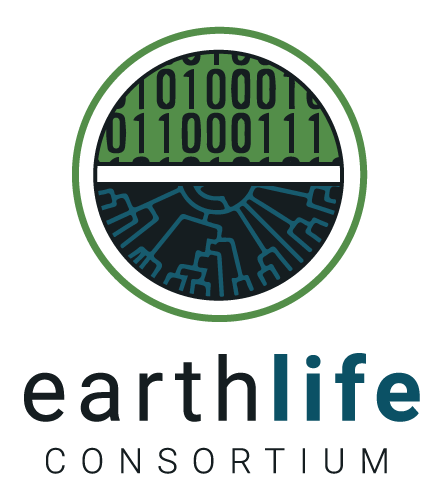

# 

<h2>Hacking the Disciplinary Silo.</h2>
<h3>Bridging Ecology & the Earth Sciences with a bit of code and a lot of hard work</h3>

<div style="font-size:33px">
```{r engine='xml', eval = FALSE}
<rdf:RDF
 xmlns:rdf="http://www.w3.org/1999/02/22-rdf-syntax-ns#"
 xmlns:rdfs="http://www.w3.org/2000/01/rdf-schema#"
 xmlns:foaf="http://xmlns.com/foaf/0.1/">
 <foaf:Person rdf:ID="me">
  <foaf:name>Simon Goring</foaf:name>
  <foaf:mbox rdf:resource="mailto:goring@wisc.edu"/>
  <foaf:homepage rdf:resource="simongoring.github.io"/>
  <foaf:Organization>University of Wisconsin - Madison</foaf:Organization>
  <foaf:currentProject>Neotoma Paleoecological Database</foaf:currentProject>
 </foaf:Person>
</rdf:RDF>
```
</div>

<div style="text-align: left">         </div>

```{r setup, include=FALSE, echo = FALSE, warning=FALSE, message=FALSE}
knitr::opts_chunk$set(cache = TRUE)
```

```{r, echo = FALSE, warning=FALSE, message=FALSE}
library(venneuler, quietly = TRUE)
source('R/get_repo_info.R')

```

# {data-background-image="images/backgroundertry.png" data-background-size="800px"}

<!-- Databases have arisen multiple times, across disciplines, for various reason. -->

# {data-background="images/background_silo.png" data-background-size="800px"}

<!-- around these databases, user groups have developed.  Many databases have 
     developed wth certain peculiarities, whether insider knowledge of data,
     access, regardless, there are specific ontologies that relate to the data
     that potentially limit access to these resources.-->

```{r, echo = FALSE, fig.cap="Subject Cateogorization from the Registry of Research Data Repositories", fig.width = 6, fig.height = 6}
# Systems of record work within specified communities and archive data, with very little interaction between and across communities.

get_repos <- pull_repos()

# repo <- get_repos[[1]]
# repo$labels <- rep(NA, length(repo$labels))
# png(filename = 'images/venn_sub_empty.png', width = 1000, height = 1000, res = 300)
# plot(get_repos[[1]])

```

# {data-background="images/venn_empty.png" data-background-size="800px"}

<!-- When we look at these databases more broadly, here we are taking information
     from the re3 database of databases, we see that the majority of databases are 
     considered single discipline, and overlap varies by discipline. -->

# {data-background="images/venn_sub_empty.png" data-background-size="800px"}

<!-- When we break things down further, looking exclusively at subjects or subject
     combinations that occur more than once, we can see that again, there is more
     mono-disciplinary data than cross-disciplinary data, and, surprisingly, no
     overlap between ecology & the geosciences. -->


# 



# Wicked Problems


<!-- the challenges we face are complex & require interdisciplinary interaction. -->

# {data-background="images/cohmap_slide.png" data-background-size="800px"}

<!-- Some specific applications brought together teams of individuals across silos, and left a legacy of cooperation. -->

<!-- When we think of specific examples, the first is COHMAP, but others
     present themselves, critical research developments that have resulted
     from key interdisciplinary engagement. --> 

# {data-background="images/disciplinary_bridge.png" data-background-size="800px"}

<!-- But to bridge data sets in a continual manner still requires 
     considerable effort -->

# {data-background="images/disciplinary_bridge_engage.png" data-background-size="800px"}

<!-- Engagement with communities outside traditional spheres of reference -->

# {data-background="images/background_silo.png" data-background-size="800px"}

<!-- Engagement with different dataset types -->

# {data-background="images/pbdb_sphere.png" data-background-size="800px"}

<!-- Paleobiology Database (associated tools) -->

# {data-background="images/neotoma_sphere.png" data-background-size="800px"}

<!-- Neotoma (associated databases & tools?) -->

# {data-background="images/alignment.png" data-background-size="800px"}

# Cooperation is Key

# Code-operation is Key

# {data-background="images/api_example.png" data-background-size="800px"}

# {data-background="images/engagement_record.png" data-background-size="800px"}

# {data-background="images/engagement_discip.png" data-background-size="800px"}

#
<table style="border:solid 0px #ccc"><tr><td></td>
<td valign="middle">
[http://bit.ly/2besghQ]()
</td></tr>
<td></td><td>
[http://earthlifeconsortium.org]()
</td></tr><td></td>
<td>
[@sjgoring](http://twitter.com/sjgoring)
</td>
</tr>
</table>