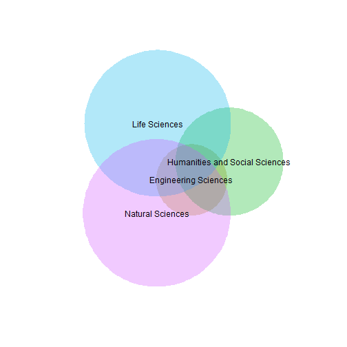

Hacking apart the disciplinary silo. Bridging ecology & the earth sciences with a bit of code and a lot of hard work
========================================================
author: Simon Goring - University of Wisconsin - Madison
date: August 10, 2016
autosize: true

First Slide
========================================================

Data repositories often arise organically around key questions or individuals.

Second Slide
========================================================

These include VertNet, PaleoDB, Neotoma - silos that initially (and sometimes still) required specialized access - knowing someone, having inside knowledge &cetera

Third Slide
========================================================

Fourth Slide
========================================================

Some specific applications brought together teams of individuals across silos, and left a legacy of cooperation.

Fifth Slide
========================================================

COHMAP example

Sixth Slide
========================================================

But to bridge data sets in a continual manner still requires considerable effort

Seventh Slide
========================================================

Engagement with communities outside traditional spheres of reference

Eighth Slide
========================================================

Engagement with different data types

Nine Slide
========================================================

EarthLife Consortium

Ten Slide
========================================================

Paleobiology Database (associated tools)

Eleven Slide
========================================================

Neotoma (associated databases & tools?)

Twelve Slide
========================================================

Engaging outside the discipline requires considerable effort to align terms of reference

Thirteen Slide
========================================================

Taxonomies, data structures, semantics

Fourteen Slide
========================================================

Requires working together

Fifteen Slide
========================================================

Requires coding together

Sixteen Slide
========================================================

Results in new tools & new discoveries that can profoundly change the way we interact

Seventeen Slide
========================================================

Moves databases from systems of record to systems of engagement

Eighteen Slide
========================================================

Moves data from a single discipline to multiple disciplines & opens up new transformative avenues of research

Nineteen Slide
========================================================

* [Presentation](https://github.com/SimonGoring/Hacking_Disciplines-ESA2016_IGN5-4)
* [EarthLife Consortium](http://earthlifeconsortium.org)

* [Twitter](http://twitter.com/sjgoring)
